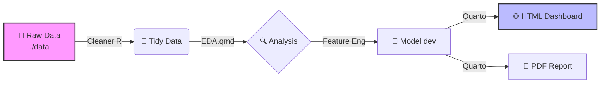

# 🏢 MasterControl Capstone: Command Center
**MSBA IS 6813 | Spring 2026**

[]()
[-blue?style=flat-square)]()
[]()

---

## 🛠️ Functional Hub
| [📋 Deliverable Specs](./Group%20Docs/Assignments.md) | [📊 Data Room](./data/) | [📝 Question Log](./Group%20Docs/Sponsor_QA.md) | [🌐 Live Dashboard](https://thomasscottbeck-sudo.github.io/MSBA-Capstone-MasterControl-Group-x/) |
| :---: | :---: | :---: | :---: |

---

## 📅 Mission Milestones (Hard Deadlines)
| Phase | Milestone | Hard Deadline |
| :---: | :--- | :--- |
| 🟢 | **Business Problem Statement** | **Jan 28** |
| 🟡 | **EDA Group Notebook** | **Feb 18** |
| ⚪ | **Modeling Notebook** | **Mar 18** |
| ⚪ | **Practice Presentation** | **Apr 05** |
| ⚪ | **Final Sponsor Delivery** | **Apr 08/15** |
| ⚪ | **Portfolio & Peer Eval** | **Apr 19** |

---

## ⚙️ Developer Tooling & Automation

### 1. Notebook Standards & The "Golden" YAML
**Primary Directive:** Quarto (`.qmd`) is the required notebook format. It provides a unified engine for both R (`knitr`) and Python (`jupyter`).

<details>
<summary><b>🔻 CLICK TO EXPAND: Copy the Golden YAML Header</b></summary>
<br>
Copy this block exactly into the top of every <code>.qmd</code> file to ensure HTML/PDF parity:

```yaml
---
title: 
subtitle: 
date: "Spring 2026"
format:
  html:
    theme: journal
    toc: true
    toc-depth: 3
    toc-float: true
    number-sections: false
    code-fold: true
    code-tools: true
    df-print: paged
    highlight-style: github
  pdf:
    documentclass: article
    geometry:
      - margin=1in
    toc: true
    number-sections: false
    colorlinks: true
    mainfont: "Arial"
    sansfont: "Arial"
    monofont: "Courier New"
editor: visual
---
```
</details>

### 2. Efficiency Shortcuts
* **Track Changes:** View the real-time [Audit Trail](../../commits/main).
* **Task Management:** Track progress via [Milestones](../../milestones).
* **Reproducibility:** Always use `here::here("data", "filename.csv")`.

---

## 🧠 Data Pipeline Architecture (Mermaid.js)
*Visual representation of the project workflow. GitHub renders this natively.*



## 📂 Physical Directory Structure
```text
├── data/               # RAW data (Local only - Git ignored)
├── notebooks/
│   ├── final/          # Shared Group Deliverables (.qmd)
│   └── individual/     # Individual "Sandboxes" for portfolio
├── output/             # Exported .csv results and .png plots
├── Group Docs/         # Meeting notes and sponsor requirements
└── README.md           # This Hub
```

---
> **Lead Architect Note:** Before starting any work session, run `git pull` to sync the latest model changes from the team.