# 📊 MSBA Capstone - Group Project Dashboard
**MSBA IS 6813 | Spring 2026**

[]()
[-blue?style=flat-square)]()
[]()

---

## 🛠️ Functional Hub

| [📋 Deliverable Specs](./docs/Assignments.md) | [📊 Data Room](./data/) | [📝 Question Log](./docs/Sponsor_QA.md) | [🌐 Group Dashboard](https://thomasscottbeck-sudo.github.io/MSBA-Capstone-MasterControl-Group-X/) | [💻 GitHub Repo](https://github.com/thomasscottbeck-sudo/MSBA-Capstone-MasterControl-Group-X) |
| :---: | :---: | :---: | :---: | :---: |

---

## 📅 Mission Milestones (Hard Deadlines)

| Phase | Milestone | Hard Deadline |
| :---: | :--- | :--- |
| 🟢 | **Business Problem Statement** | **Jan 28** |
| 🟡 | **EDA Group Notebook** | **Feb 18** |
| ⚪ | **Modeling Notebook** | **Mar 18** |
| ⚪ | **Practice Presentation** | **Apr 05** |
| ⚪ | **Final Sponsor Delivery** | **Apr 08/15** |
| ⚪ | **Portfolio & Peer Eval** | **Apr 19** |

---

## ⚙️ Developer Tooling & Automation

### 1. Notebook Standards & The "Golden" YAML
**Primary Directive:** Quarto (`.qmd`) is the required notebook format. It provides a unified engine for both R (`knitr`) and Python (`jupyter`).

<details>
<summary><b>🔻 CLICK TO EXPAND: Copy the Golden YAML Header</b></summary>
<br>

Copy this block exactly into the top of every <code>.qmd</code> file to ensure HTML/PDF parity:

```yaml
---
title: 
subtitle: 
date: "Spring 2026"
format:
  html:
    theme: journal
    toc: true
    toc-depth: 3
    toc-float: true
    number-sections: false
    code-fold: true
    code-tools: true
    df-print: paged
    highlight-style: github
  pdf:
    documentclass: article
    geometry:
      - margin=1in
    toc: true
    number-sections: false
    colorlinks: true
    mainfont: "Arial"
    sansfont: "Arial"
    monofont: "Courier New"
editor: visual
---
```

</details>

### 2. Foolproof Data Loading (The "Here" Rule)
**Strict Rule:** Never use absolute paths (e.g., `C:/Users/Thomas/...`).
To ensure code runs on every team member's machine instantly without changing paths:

1.  **Save Raw Data:** Place all raw CSVs/Excel files in your local `data/` folder.
2.  **Load Data:** Use the `here` library to detect the project root automatically.

```r
# ✅ CORRECT: Works on Mac, Windows, and Linux automatically
library(here)
df <- read.csv(here::here("data", "application_train.csv"))

# ❌ INCORRECT: Breaks on other computers
df <- read.csv("C:/Users/Thomas/Repos/Project/data/application_train.csv")
```

### 3. Efficiency Shortcuts
* **Track Changes:** View the real-time [Audit Trail](../../commits/main).
* **Task Management:** Track progress via [Milestones](../../milestones).

---

## 🧠 Repository Architecture & Usage Flow
*Visual map of how files, data, and code interact within this repository.*

```mermaid
graph TD
    %% Nodes
    Data(📂 data/ <br/> 🔒 Local Only <br/> <i>Raw CSVs</i>)
    Docs[📂 docs/ <br/> 📋 Specs & QA]
    NB_Ind[📂 notebooks/individual/ <br/> 🧪 <b>Sandbox</b> <br/> <i>Messy Work</i>]
    NB_Fin[📂 notebooks/final/ <br/> 🚀 <b>Deliverables</b> <br/> <i>Polished Code</i>]
    Out[📂 output/ <br/> 📤 Exports <br/> <i>Plots/CSVs</i>]

    %% Edge Connections
    Data -->|Load via 'here::here'| NB_Ind
    Data -->|Load via 'here::here'| NB_Fin
    Docs -.->|Guiding Specs| NB_Ind
    NB_Ind -->|Refine & Merge| NB_Fin
    NB_Fin -->|Render/Save| Out

    %% Styles
    style Data fill:#f8d7da,stroke:#721c24,stroke-width:2px,stroke-dasharray: 5 5
    style NB_Fin fill:#d4edda,stroke:#155724,stroke-width:2px
    style NB_Ind fill:#fff3cd,stroke:#856404,stroke-width:2px
    style Out fill:#e2e3e5,stroke:#383d41,stroke-width:2px
```



## 📂 Physical Directory Structure
```text
├── data/               # RAW data (Local only - Git ignored)
├── notebooks/
│   ├── final/          # Shared Group Deliverables (.qmd)
│   └── individual/     # Individual "Sandboxes" for portfolio
├── output/             # Exported .csv results and .png plots
├── docs/               # Meeting notes and sponsor requirements
└── README.md           # This Hub
```

---

## 📞 Contact Information

| Team Member | Email (Personal) | Email (University) | Phone |
| :--- | :--- | :--- | :--- |
| **Thomas Beck** | thomasscottbeck@gmail.com | u0399590@utah.edu | +1 (801) 631-2080 |
| **Max Ridgeway** | [TBD] | [TBD] | +1 (801) 597-3824 |

---
> **Lead Architect Note:** Before starting any work session, run `git pull` to sync the latest model changes from the team.
